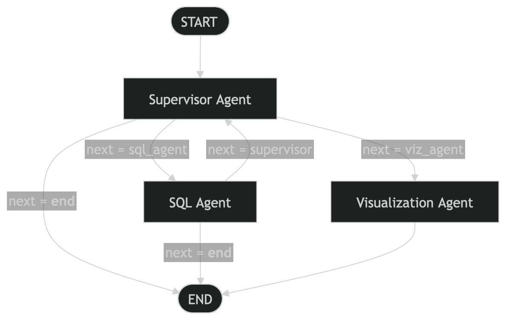

# AI Agents Playground

This repository contains experiments with:

- a standalone Retrieval-Augmented Generation pipeline in `rag.py`
- a standalone tool-calling calculator agent in `tool_calling.py`
- a multi-agent orchestration flow using LangGraph in `graph.py`

## High-Level Overview

This project combines standalone LLM experiments with a production-style multi-agent movie analytics app.

- `app.py`: Streamlit chat UI that sends user questions into the LangGraph workflow and renders SQL + chart results.
- `graph.py`: orchestration layer that wires `supervisor`, `sql_agent`, and `viz_agent` into a controlled execution graph.
- `supervisor/supervisor_agent.py`: routing brain that decides whether to fetch data (`sql_agent`), visualize (`viz_agent`), or finish.
- `sql/sql_agent.py`: data access specialist that loads IMDB data into SQLite and uses LangChain SQL tools to answer analytical queries.
- `visualisation/visualisation_agent.py`: chart specialist that converts SQL results into ECharts JSON config for frontend rendering.
- `state.py`: shared graph state contract (`next`, `messages`, `user_query`, `chart_config`, `final_answer`) passed between nodes.
- `llm_factory.py`: centralized model factory to instantiate OpenAI/Anthropic chat models.

At runtime, the normal flow is:

1. User asks a movie question in Streamlit.
2. `supervisor` routes to `sql_agent` to fetch/compute data.
3. If visualization is needed, `supervisor` routes to `viz_agent`.
4. Graph ends and UI displays text results and optional chart output.

## Setup

1. Create and activate a virtual environment.
2. Install dependencies:

```bash
pip install -r requirements.txt
```

3. Add a `.env` file in the project root with:

```env
OPENAI_API_KEY=your_openai_key
PINECONE_API_KEY=your_pinecone_key
```

## `rag.py` (Standalone RAG Demo)

`rag.py` is an independent script that demonstrates a complete RAG-style flow:

1. Split a short company profile into chunks
2. Embed chunks with OpenAI embeddings (`text-embedding-3-small`)
3. Store vectors in Pinecone (`test-index`)
4. Retrieve relevant chunks for a user query
5. Re-rank retrieval results using a CrossEncoder model
6. Generate a final answer with `gpt-4o-mini`

Run:

```bash
python rag.py
```

Expected behavior:

- creates the Pinecone index if it does not exist
- upserts chunk vectors
- runs retrieval + reranking + LLM answer generation
- prints the final response to terminal

## `tool_calling.py` (Standalone Tool Calling Demo)

`tool_calling.py` is another independent script showing LangChain tool calling with structured output.

Included tools:

- `add(a, b)`
- `subtract(a, b)`
- `multiply(a, b)`
- `divide(a, b)`

It builds a calculator agent with:

- model: `gpt-4o-mini`
- tools: arithmetic functions above
- response schema: `Calculator` (Pydantic model)

Run:

```bash
python tool_calling.py
```

Expected behavior:

- agent receives a math question
- decides which tools to call
- returns and prints a structured numeric result

## LangGraph Flow (`graph.py`)

The graph starts from `START`, routes through `supervisor`, and conditionally dispatches to `sql_agent` or `viz_agent`.

Rendered diagram:



## Streamlit App

To run the UI that uses `graph.py`:

```bash
streamlit run app.py
```

The app accepts movie questions, runs the graph, shows SQL responses, and renders chart output when visualization is triggered.

